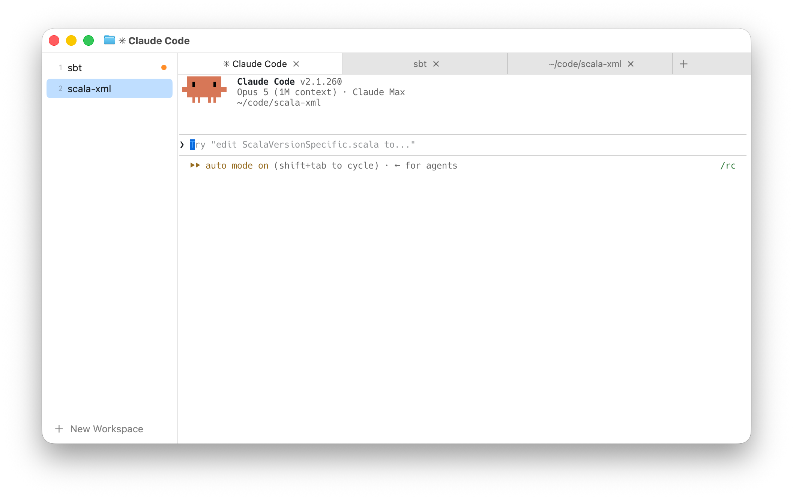

# Workspaces fork

macOS-only fork of Ghostty adding cmux-style workspaces. Not intended for upstream.



A sidebar lists workspaces; each workspace has its own tabs, shown in a custom
tab strip. Native macOS window tabs are disabled — one window holds every
workspace, and background tabs keep running. A bell in an inactive tab or
workspace shows an orange dot. Window restoration covers all workspaces.

Tab strip: click selects, `x` or middle click closes, `+` adds, drag reorders.
Sidebar rows: click switches, right-click renames or closes. `undo` restores a
closed tab, workspace or window.

## Keybinds

`new_workspace`, `close_workspace`, `rename_workspace`, `previous_workspace`,
`next_workspace`, `goto_workspace:N`; defaults `cmd+ctrl+n/w/r` and
`cmd+ctrl+alt+up/down`. The existing tab actions (`new_tab`, `close_tab`,
`goto_tab`, `move_tab`, ...) operate on the workspace model.

## Bell dots for Claude Code

To get a dot when Claude Code finishes a turn or needs input, add to
`~/.claude/settings.json`:

```json
{
  "hooks": {
    "Stop": [{ "hooks": [{ "type": "command", "command": "t=$(ps -o tty= -p $PPID | tr -d \" \"); { [ -n \"$t\" ] && [ \"$t\" != \"??\" ] && printf \"\\a\" > \"/dev/$t\"; } 2>/dev/null || true" }] }],
    "PermissionRequest": [{ "hooks": [{ "type": "command", "command": "t=$(ps -o tty= -p $PPID | tr -d \" \"); { [ -n \"$t\" ] && [ \"$t\" != \"??\" ] && printf \"\\a\" > \"/dev/$t\"; } 2>/dev/null || true" }] }]
  }
}
```

The tty is resolved from the parent process because hooks have no controlling
terminal — plain `> /dev/tty` fails with "Device not configured".

## Building

Needs Xcode and the Metal toolchain (`xcodebuild -downloadComponent MetalToolchain`).

```
zig build -Doptimize=ReleaseFast    # app bundle in zig-out/Ghostty.app
```

Copy it to `/Applications` or run it in place with `open zig-out/Ghostty.app`.

## Internals

One `NSWindow` per `TerminalController`, `tabbingMode = .disallowed`:

```
TerminalController (1 NSWindow)
└─ WorkspaceList          workspaces, active
   └─ Workspace           name, tabs, activeTab
      └─ TerminalTab      surfaceTree (splits), focusedSurface, titleOverride
```

Only the active tab's tree is mounted as `TerminalController.surfaceTree`; the
controller writes tree/focus/title changes back to the active tab
(`surfaceTreeDidChange`, `focusedSurfaceDidChange`, `titleOverride`). Switching
tabs swaps the mounted tree; unmounted surfaces are marked unfocused and
occluded but keep running. Restoration state is version 8.

Code: `macos/Sources/Features/Workspaces/` (model, sidebar, tab strip, Workspace
menu) and `macos/Sources/Features/Terminal/TerminalController.swift`.

Not implemented: tab colors, macOS tab overview, move-tab-to-new-window, sidebar
hide option, tabs listed under workspaces.

Dev builds: plain `zig build` is a debug build and hides Swift errors; see them
with `cd macos && xcodebuild -project Ghostty.xcodeproj -scheme Ghostty
-configuration Debug -arch arm64 build 2>&1 | grep error`. Overwriting the
bundle while it runs invalidates the signature; fix with `codesign --force
--deep -s - zig-out/Ghostty.app`.
